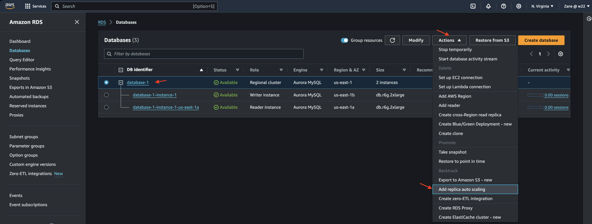

# Auto Scaling a MySQL Database

Auto Scaling a MySQL Database to Meet Fluctuating Application Demands with Amazon Aurora

# Overview

Amazon Aurora is a MySQL and PostgreSQL-compatible relational database that combines the performance and availability of traditional enterprise databases with the simplicity and cost-effectiveness of open source databases.

# Steps:

# 1. Creatae an Aurora DB cluster

Create Database

On Create Database page choose Standard

For Engine Option,Select Amazon Aurora MySQL-Compatible.

Select the latest engine version of Aurora MySQL

Choose the Production sample template. 

Under Settings, choose an identifier for your Aurora DB cluster, such as database-1

For the DB instance class, retain the default selection for Memory optimized classes and for size, select a large instance (ending with .large).

Under Availability & durability, select Create an Aurora Replica or Reader in a different AZ (recommended for scaled availability).

Under the Connectivity section, select Don’t connect to an EC2 compute resource.

Select the VPC where you want to create the database. For this Project, select the Default VPC. 

Note that once created, a database can't be migrated to a different VPC. Then choose the default value for the DB Subnet group.

For Public access, select No. This means you will have to connect to the database from an EC2 instance within the same VPC.

In the VPC security group section, select Create new. 

If you happen to have a security group that allows incoming TCP connections on port 3306, you can choose it instead. This security group will control ingress to your Aurora cluster.

In New VPC security group name, enter aurora-sg.

Leave the default value for Database authentication and default values for Monitoring.

Open Additional configuration. For Initial database name enter aurora_dbt. 

Scroll down to the Deletion protection section. The best practice is to select Enable deletion protection. 

However, if you want to delete the database at the end of the Project, you will need to leave this unselected.

After a quick review of all the fields in the form, you can proceed. Choose Create database.

Database Succefully Created and available

# 

# 2. Save Credentials

Choose View connection details.

Save the Master username, Master password, and the Endpoint.

After closing the Connection details popup, select the name of the database you created from the DB identifier list.

Copy the Writer and Reader endpoints. You can direct any read/write traffic to the Writer endpoint, but it's a good practice to direct read-only traffic to the Reader endpoint.

# 3. Add a scaling policy

Select your Aurora DB cluster. 

Choose Actions and then select Add replica auto scaling.

 Under Policy name, enter aurora-policy-1.

 Choose a Target metric to use for the auto scaling.(Average CPU utilization of Aurora Replicas)

 For Target value, enter 20.

 For Minimum capacity, enter 1. For Maximum capacity, enter 2.

 Choose Add policy.
 
# 

# 4. Modify a scaling policy

Select your Aurora DB cluster.

Select Logs & events.

Select your Auto scaling policy and choose Edit.

Change the Maximum capacity to 4 and choose Save.

# Additional Resources

[Amazon Aurora Documentation](https://docs.aws.amazon.com/AmazonRDS/latest/AuroraUserGuide/WhatIsAurora.html): Official documentation for Amazon Aurora, providing detailed information on features, configurations, and best practices.

[AWS Auto Scaling Documentation](https://docs.aws.amazon.com/autoscaling/index.html): Documentation for AWS Auto Scaling, covering various scaling options and strategies for different AWS services.

